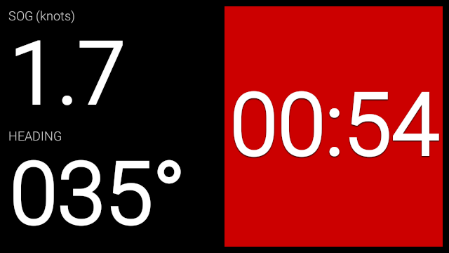
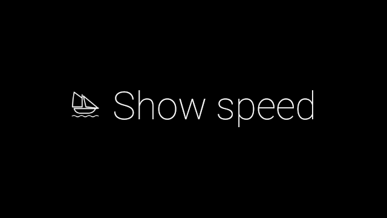
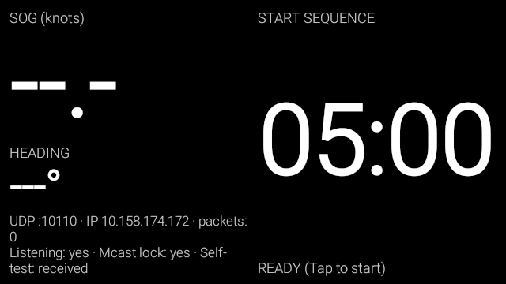
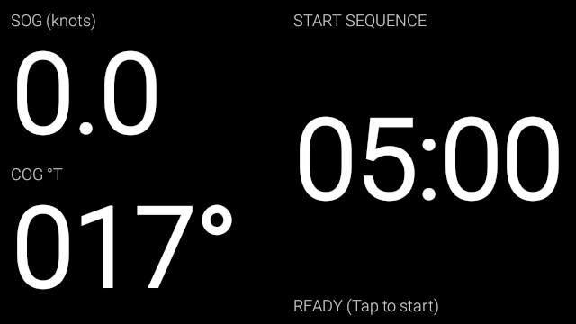
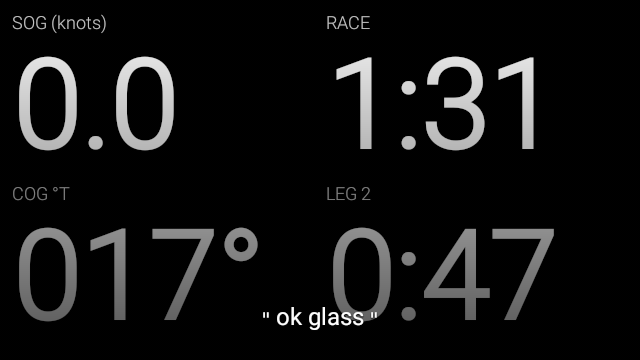
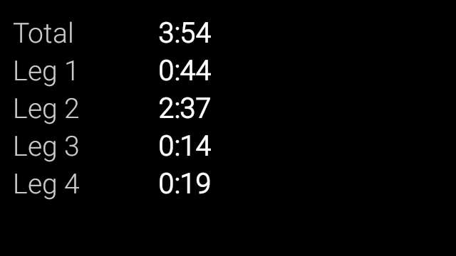

# Race Day: A Sailing Racing Utility for Google Glass Explorer Edition

An application for use when racing sailboats. It shows speed over ground and heading (streamed from OpenCPN), as well as a start sequence countdown and race timer. Tested on Glass Explorer Edition XE-C.

*Above: sailing on a 35-degree heading at 1.7 knots, 54 seconds before the race starts.*

Nota bene: this project is vibecoded, because I don't know how to write Kotlin yet. Since it runs only on an outdated piece of experimental hardware, the risk isn't great, but who knows? It could brick your Glass, I dunno.

## Installation

To install, grab the latest APK from the repo's GitHub releases page, then run `adb install raceday.apk`. The package name is `net.jfloren.raceday`, in case you need to uninstall it. (Make sure you do `Settings -> Device Info -> Turn on Debug` on your Glass before you try to install)

To open the application, select "Show speed" from the Glass menu (below) or say "OK Glass, show me my speed".

### Setting up NMEA data

To display your heading and speed, Glass needs to receive NMEA sentences via UDP on port 10110. The app parses VTG, RMC, HDT, HDM, and HDG sentences. If a compass is sending heading (HDT, HDM, or HDG), it shows that, labelled "HDG"; otherwise it shows GPS course over ground, labelled "COG". It shows magnetic degrees (°M) whenever it knows the magnetic variation (from RMC or HDG sentences), and true degrees (°T) otherwise.

Until it starts receiving usable NMEA data, the app displays its IP address and some diagnostics below the heading (see below). You can use this IP address to configure your NMEA stream.

I use OpenCPN to stream NMEA, configuring it like this:

* Turn on the hotspot on my Android phone and connect Glass to it.
* Start the app and note the IP address.
* In OpenCPN, open Settings and go to "Connections" -> "Add new connection...", then in the wizard select "Network" and "UDP". Set the address to the IP address displayed on Glass and the port to 10110, then uncheck "Receive Input on this Port", check "Output on this port", and save it.

Your Glass should soon start showing a heading and speed.

If you have a wifi network on your boat, you may be able to configure NMEA broadcasts to 255.255.255.255 and have the Glass connect to the same network; this does not reliably work with a phone hotspot, however.

## Using the App

When first started, the app is waiting to begin the starting sequence:

Tap the touchpad to start the sequence. It will begin counting down from 5 minutes. If you started it a bit late, tap the touchpad at any time during the countdown to sync to the next signal (4 minutes, 1 minute, or the start). Glass plays a short tone at 5, 4, and 1 minutes, and a long tone at the start, and the display stays on for the whole countdown.
								   
When the countdown gets to 1 minute, the timer background goes red to draw your attention:

When the countdown hits zero, it switches to stopwatch mode, showing the total race time and the time on the current leg. Tap the touchpad to bring up a menu where you can select "next leg" (when you round a mark) or "finish race". You can also say "OK Glass, next track" or "OK Glass, stop the timer"; these voice commands are only available during the race.

When you finish the race, you'll get a display of total time and leg times:

When you're done with that, swipe down to return to the main display, where you can use the tap menu to either start a new race or view the results again. Note that starting a new race will wipe out your previous race times!

## Notes

You can leave the application during the start sequence or the race itself, for instance to take a photo, and the timer values will persist when you come back.

Once the actual race starts, the screen will sleep after a bit. Tap the touchpad or tilt your head to wake it back up.
